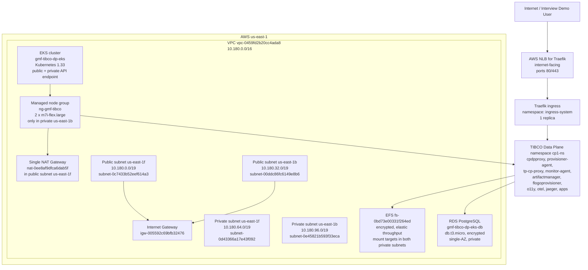

# TIBCO Platform Data Plane on EKS - Interview Packet

Cluster reviewed: `gmf-tibco-dp-eks` in `us-east-1`  
Account observed: `793826056672`  
Purpose: lab TIBCO Platform Data Plane environment, not production.

Sources used:
- TIBCO EKS workshop: https://github.com/TIBCOSoftware/tp-helm-charts/tree/main/docs/workshop/eks
- TIBCO Platform docs: https://docs.tibco.com/pub/platform-cp/1.18.0/doc/html/Default.htm

## Actual Architecture



## What Exists

- VPC `vpc-0459fd2b20cc4ada8`, CIDR `10.180.0.0/16`, non-default, tagged for dev/TIBCO/eksctl.
- Two public subnets and two private subnets across `us-east-1b` and `us-east-1f`.
- One internet gateway and one NAT gateway.
- EKS cluster is active, Kubernetes `1.33`, platform `eks.41`.
- Cluster endpoint has both private and public access enabled; public access CIDR is `0.0.0.0/0`.
- Managed add-ons: `vpc-cni`, `coredns`, `kube-proxy`, `aws-ebs-csi-driver`, `aws-efs-csi-driver`.
- Node group `ng-gmf-tibco`: 2 desired, max 2, min 1, `m7i-flex.large`, on-demand, private subnet `subnet-0e45821b593f33eca` only.
- IRSA is configured for VPC CNI, AWS Load Balancer Controller, ExternalDNS, and cert-manager.
- Helm releases include TIBCO Data Plane services, AWS Load Balancer Controller, cert-manager, Traefik, Jaeger, OpenTelemetry collectors, artifact manager, Flogo provisioner, and monitor agent.
- Storage classes: `gp2` and `efs-sc`. One PVC `artifactmanager-integration` is bound to `efs-sc`.
- Ingress classes: `alb`, `traefik`, and TIBCO HAProxy ingress class.
- Traefik service is an internet-facing NLB using instance target mode with NodePorts.
- RDS PostgreSQL exists but is `db.t3.micro`, private, encrypted, single-AZ.
- EFS is encrypted and has mount targets in both private subnets.
- No ECR repositories were found.
- Metrics API is missing; HPA exists for `cp-proxy`, `cpdpproxy`, and `provisioner-agent`, but metrics show `<unknown>`.
- No Kubernetes network policies, resource quotas, or limit ranges were found.
- PDBs exist only for CoreDNS and EBS CSI, not for TIBCO workloads.

## Interview Talk Track

Use this framing:

> I created an EKS-based TIBCO Platform Data Plane lab to understand the runtime mechanics: VPC/subnet layout, private worker nodes, IRSA, AWS Load Balancer Controller, Traefik ingress, EFS-backed artifact storage, RDS PostgreSQL, and TIBCO control-plane connectivity through the data-plane services. For production, I would not present this as finished. I would harden it around multi-AZ node groups, metrics-driven autoscaling, private endpoint access, network policy, TLS/DNS governance, ECR image lifecycle, CloudWatch retention, disaster recovery, and pharma-grade audit controls.

## Gap Analysis

### 1. Node group is not multi-AZ

Current state: VPC has two private subnets, but the managed node group is only in `subnet-0e45821b593f33eca` in `us-east-1b`.

Risk: an AZ event can take down the whole data plane.

Commands:

```bash
eksctl create nodegroup \
  --cluster gmf-tibco-dp-eks \
  --region us-east-1 \
  --name ng-gmf-tibco-prod-multi-az \
  --node-type m7i-flex.large \
  --nodes 3 \
  --nodes-min 3 \
  --nodes-max 8 \
  --managed \
  --node-private-networking \
  --subnet-ids subnet-0e45821b593f33eca,subnet-0d43366a17e43f092 \
  --labels role=tibco-worker,environment=prod \
  --tags Environment=prod,Project=tibco-platform-eks,CostCenter=TIBCO-PLATFORM

kubectl cordon -l alpha.eksctl.io/nodegroup-name=ng-gmf-tibco
kubectl drain -l alpha.eksctl.io/nodegroup-name=ng-gmf-tibco \
  --ignore-daemonsets --delete-emptydir-data

eksctl delete nodegroup \
  --cluster gmf-tibco-dp-eks \
  --region us-east-1 \
  --name ng-gmf-tibco
```

### 2. Single NAT gateway

Current state: both private route tables point to one NAT gateway in one AZ.

Risk: NAT failure or AZ issue breaks image pulls, outbound APIs, package updates, and external SaaS calls.

Commands:

```bash
EIP_ALLOC_ID=$(aws ec2 allocate-address \
  --region us-east-1 \
  --domain vpc \
  --query AllocationId --output text)

NAT_GW_1B=$(aws ec2 create-nat-gateway \
  --region us-east-1 \
  --subnet-id subnet-00ddc86fc6149e8b6 \
  --allocation-id "$EIP_ALLOC_ID" \
  --tag-specifications 'ResourceType=natgateway,Tags=[{Key=Name,Value=gmf-tibco-nat-us-east-1b},{Key=Environment,Value=prod}]' \
  --query NatGateway.NatGatewayId --output text)

aws ec2 wait nat-gateway-available \
  --region us-east-1 \
  --nat-gateway-ids "$NAT_GW_1B"

aws ec2 replace-route \
  --region us-east-1 \
  --route-table-id rtb-0f1d04dc9d5dde6d3 \
  --destination-cidr-block 0.0.0.0/0 \
  --nat-gateway-id "$NAT_GW_1B"
```

### 3. Public EKS API endpoint is open to the world

Current state: public endpoint enabled with `0.0.0.0/0`.

Risk: unnecessary management-plane exposure.

Commands:

```bash
MY_CORPORATE_CIDR="x.x.x.x/32"

aws eks update-cluster-config \
  --region us-east-1 \
  --name gmf-tibco-dp-eks \
  --resources-vpc-config endpointPrivateAccess=true,endpointPublicAccess=true,publicAccessCidrs="$MY_CORPORATE_CIDR"

# Stronger production option after VPN/Direct Connect/bastion is ready:
aws eks update-cluster-config \
  --region us-east-1 \
  --name gmf-tibco-dp-eks \
  --resources-vpc-config endpointPrivateAccess=true,endpointPublicAccess=false
```

### 4. Metrics server is missing; HPA cannot work

Current state: HPA exists but metrics are `<unknown>` and `kubectl top` fails.

Commands:

```bash
helm repo add metrics-server https://kubernetes-sigs.github.io/metrics-server/
helm repo update

helm upgrade --install metrics-server metrics-server/metrics-server \
  --namespace kube-system \
  --set args="{--kubelet-preferred-address-types=InternalIP,Hostname,--kubelet-use-node-status-port}"

kubectl wait --for=condition=Available deployment/metrics-server \
  -n kube-system --timeout=300s

kubectl top nodes
kubectl get hpa -n cp1-ns
```

### 5. Cluster autoscaler or Karpenter is missing

Current state: HPA can scale pods only if nodes have capacity; node group max is 2.

Commands for Cluster Autoscaler:

```bash
eksctl create iamserviceaccount \
  --cluster gmf-tibco-dp-eks \
  --region us-east-1 \
  --namespace kube-system \
  --name cluster-autoscaler \
  --attach-policy-arn arn:aws:iam::aws:policy/AutoScalingFullAccess \
  --approve \
  --override-existing-serviceaccounts

helm repo add autoscaler https://kubernetes.github.io/autoscaler
helm repo update

helm upgrade --install cluster-autoscaler autoscaler/cluster-autoscaler \
  --namespace kube-system \
  --set autoDiscovery.clusterName=gmf-tibco-dp-eks \
  --set awsRegion=us-east-1 \
  --set rbac.serviceAccount.create=false \
  --set rbac.serviceAccount.name=cluster-autoscaler
```

### 6. Traefik is public, HTTP is open, and NLB uses instance target mode

Current state: internet-facing NLB exposes 80/443, and NodePorts are visible in security groups.

Production options:
- For internal pharma integrations: use internal NLB/ALB and private hosted zone.
- For public APIs: use TLS-only, WAF/CloudFront or ALB, ACM cert, Route 53, and no direct HTTP.

Commands for internal NLB posture:

```bash
helm upgrade traefik traefik/traefik \
  --namespace ingress-system \
  --reuse-values \
  --set service.annotations."service\.beta\.kubernetes\.io/aws-load-balancer-scheme"=internal \
  --set service.annotations."service\.beta\.kubernetes\.io/aws-load-balancer-nlb-target-type"=ip
```

Commands to remove public NodePort rules after changing target mode and verifying traffic:

```bash
aws ec2 revoke-security-group-ingress \
  --region us-east-1 \
  --group-id sg-00522f2a1b5dd9fa8 \
  --protocol tcp \
  --port 30746 \
  --cidr 0.0.0.0/0

aws ec2 revoke-security-group-ingress \
  --region us-east-1 \
  --group-id sg-00522f2a1b5dd9fa8 \
  --protocol tcp \
  --port 30841 \
  --cidr 0.0.0.0/0
```

### 7. No Route 53/ACM production DNS pattern is visible

Current state: ingress hosts are AWS ELB DNS names or `.platform.local`.

Commands:

```bash
DOMAIN="apps.example.com"

aws acm request-certificate \
  --region us-east-1 \
  --domain-name "*.${DOMAIN}" \
  --validation-method DNS

# After DNS validation, annotate ingress/service or Helm values with the ACM certificate ARN.
# Example for ALB-backed ingress:
kubectl annotate ingress -n cp1-ns app1-9999 \
  alb.ingress.kubernetes.io/certificate-arn="arn:aws:acm:us-east-1:ACCOUNT_ID:certificate/CERT_ID" \
  alb.ingress.kubernetes.io/listen-ports='[{"HTTPS":443}]' \
  alb.ingress.kubernetes.io/ssl-redirect='443' \
  --overwrite
```

### 8. No ECR repositories

Current state: `aws ecr describe-repositories` returned no repositories.

Commands:

```bash
for repo in tibco/bwce-apps tibco/flogo-apps tibco/platform-custom; do
  aws ecr create-repository \
    --region us-east-1 \
    --repository-name "$repo" \
    --image-scanning-configuration scanOnPush=true \
    --encryption-configuration encryptionType=AES256

  aws ecr put-lifecycle-policy \
    --region us-east-1 \
    --repository-name "$repo" \
    --lifecycle-policy-text '{
      "rules": [{
        "rulePriority": 1,
        "description": "Keep last 30 images",
        "selection": {
          "tagStatus": "any",
          "countType": "imageCountMoreThan",
          "countNumber": 30
        },
        "action": {"type": "expire"}
      }]
    }'
done
```

### 9. No Kubernetes network policies

Current state: no `NetworkPolicy` resources.

Commands:

```bash
aws eks update-addon \
  --region us-east-1 \
  --cluster-name gmf-tibco-dp-eks \
  --addon-name vpc-cni \
  --configuration-values '{"enableNetworkPolicy":"true"}' \
  --resolve-conflicts OVERWRITE

kubectl apply -f - <<'YAML'
apiVersion: networking.k8s.io/v1
kind: NetworkPolicy
metadata:
  name: default-deny-ingress
  namespace: cp1-ns
spec:
  podSelector: {}
  policyTypes:
  - Ingress
---
apiVersion: networking.k8s.io/v1
kind: NetworkPolicy
metadata:
  name: allow-ingress-from-traefik
  namespace: cp1-ns
spec:
  podSelector: {}
  policyTypes:
  - Ingress
  ingress:
  - from:
    - namespaceSelector:
        matchLabels:
          kubernetes.io/metadata.name: ingress-system
YAML
```

### 10. No namespace resource quota or limit range

Current state: no quotas/limit ranges.

Commands:

```bash
kubectl apply -f - <<'YAML'
apiVersion: v1
kind: ResourceQuota
metadata:
  name: cp1-ns-quota
  namespace: cp1-ns
spec:
  hard:
    requests.cpu: "12"
    requests.memory: 32Gi
    limits.cpu: "24"
    limits.memory: 64Gi
    pods: "100"
---
apiVersion: v1
kind: LimitRange
metadata:
  name: cp1-ns-defaults
  namespace: cp1-ns
spec:
  limits:
  - type: Container
    defaultRequest:
      cpu: 100m
      memory: 128Mi
    default:
      cpu: 500m
      memory: 512Mi
YAML
```

### 11. TIBCO workloads mostly have one replica and no PDB

Current state: TIBCO data-plane deployments are generally one replica; only CoreDNS/EBS CSI have PDBs.

Commands:

```bash
kubectl scale deployment -n cp1-ns cpdpproxy --replicas=2
kubectl scale deployment -n cp1-ns provisioner-agent --replicas=2
kubectl scale deployment -n cp1-ns tp-cp-proxy --replicas=2

kubectl apply -f - <<'YAML'
apiVersion: policy/v1
kind: PodDisruptionBudget
metadata:
  name: cpdpproxy-pdb
  namespace: cp1-ns
spec:
  minAvailable: 1
  selector:
    matchLabels:
      app.kubernetes.io/name: haproxy
---
apiVersion: policy/v1
kind: PodDisruptionBudget
metadata:
  name: provisioner-agent-pdb
  namespace: cp1-ns
spec:
  minAvailable: 1
  selector:
    matchLabels:
      app.kubernetes.io/name: provisioner-agent
YAML
```

### 12. Storage class should move from `gp2` to encrypted `gp3`

Current state: `gp2` exists and `efs-sc` exists. No `gp3` class was observed.

Commands:

```bash
kubectl apply -f - <<'YAML'
apiVersion: storage.k8s.io/v1
kind: StorageClass
metadata:
  name: gp3-encrypted
  annotations:
    storageclass.kubernetes.io/is-default-class: "true"
provisioner: ebs.csi.aws.com
parameters:
  type: gp3
  encrypted: "true"
reclaimPolicy: Delete
allowVolumeExpansion: true
volumeBindingMode: WaitForFirstConsumer
YAML

kubectl annotate storageclass gp2 storageclass.kubernetes.io/is-default-class- --overwrite
```

### 13. RDS is not production-grade

Current state: PostgreSQL is private and encrypted, but `db.t3.micro` and single-AZ.

Commands:

```bash
aws rds modify-db-instance \
  --region us-east-1 \
  --db-instance-identifier gmf-tibco-dp-eks-db \
  --db-instance-class db.m7g.large \
  --multi-az \
  --backup-retention-period 7 \
  --copy-tags-to-snapshot \
  --apply-immediately
```

### 14. CloudWatch log group has no retention or KMS key

Current state: `/aws/eks/gmf-tibco-dp-eks/cluster` has unlimited retention and no KMS key.

Commands:

```bash
aws logs put-retention-policy \
  --region us-east-1 \
  --log-group-name /aws/eks/gmf-tibco-dp-eks/cluster \
  --retention-in-days 90

aws eks update-cluster-config \
  --region us-east-1 \
  --name gmf-tibco-dp-eks \
  --logging '{"clusterLogging":[{"types":["api","audit","authenticator","controllerManager","scheduler"],"enabled":true}]}'
```

### 15. Observability is partial

Current state: OpenTelemetry and Jaeger exist, but Prometheus/Grafana/CloudWatch Container Insights were not observed.

Commands:

```bash
helm repo add prometheus-community https://prometheus-community.github.io/helm-charts
helm repo update

helm upgrade --install kube-prometheus-stack prometheus-community/kube-prometheus-stack \
  --namespace prometheus-system \
  --create-namespace \
  --set grafana.enabled=true \
  --set prometheus.prometheusSpec.retention=15d

helm repo add aws-observability https://aws.github.io/eks-charts
helm repo update

helm upgrade --install aws-for-fluent-bit aws-observability/aws-for-fluent-bit \
  --namespace amazon-cloudwatch \
  --create-namespace \
  --set cloudWatch.region=us-east-1 \
  --set cloudWatch.logGroupName=/aws/eks/gmf-tibco-dp-eks/application \
  --set cloudWatch.logRetentionDays=90
```

## TIBCO Migration Talking Points

- BW5/BW6 discovery: inventory EARs, process starters, shared resources, JDBC/JMS bindings, EMS destinations, schemas, mapper complexity, error handling, deployment properties, Hawk/TEA dependencies, and operational runbooks.
- BWCE migration: containerize stateless BW apps where possible, externalize configuration through Kubernetes Secrets/ConfigMaps, publish Docker images to ECR, deploy through Helm/GitOps, and use HPA for workload scaling.
- EMS migration choices:
  - Keep EMS where strict JMS semantics and existing contracts are required.
  - Use Amazon MQ for managed broker patterns.
  - Use MSK for Kafka/event-streaming use cases.
  - Use SQS/SNS/EventBridge for cloud-native decoupling and event routing.
- Data plane story: TIBCO Platform separates centralized control/governance from runtime execution. The data plane runs near workloads in EKS, while control-plane connectivity, observability, artifact management, and provisioning are managed through the platform services.
- Pharma posture: emphasize audit logging, encryption, least privilege, private connectivity, change control, validated deployment pipelines, observability, backup/restore, and disaster recovery.

## Likely Interview Questions and Strong Answers

Q: Why move from on-prem TIBCO to EKS?

A: To improve deployment consistency, scaling, portability, and operational isolation. BW/BWCE workloads can be packaged as images, deployed with Helm, scaled with HPA, and monitored through Kubernetes-native tooling. For migration, I would first assess which integrations should stay on JMS/EMS semantics and which can move to cloud-native messaging like Amazon MQ, MSK, SQS/SNS, or EventBridge.

Q: What did you build in your lab?

A: I built a TIBCO Platform Data Plane on Amazon EKS in `us-east-1`. It uses a dedicated VPC, public and private subnets, private worker nodes, AWS Load Balancer Controller, Traefik ingress, EFS for shared artifact storage, RDS PostgreSQL, IRSA for AWS controllers, Helm-based TIBCO platform services, and sample application ingress.

Q: What is missing for production?

A: Multi-AZ node groups, multi-AZ NAT, restricted/private EKS API access, functioning metrics-server, cluster autoscaler/Karpenter, DNS/TLS/WAF governance, ECR repositories and image scanning, network policies, resource quotas, PDBs, gp3 encrypted storage, production-sized Multi-AZ RDS, CloudWatch retention/KMS, and a GitOps/CI-CD promotion model.

Q: How would you scale a BWCE app?

A: First set CPU/memory requests and limits, then create an HPA targeting CPU/memory or custom metrics. For event-driven workloads, I would also consider queue depth or lag as a scaling metric. HPA handles pod count; cluster autoscaler or Karpenter handles node capacity.

Q: How would you handle secrets?

A: No secrets in images or plain ConfigMaps. Use Kubernetes Secrets backed by AWS Secrets Manager or External Secrets Operator, encrypt secrets at rest with KMS, and use IRSA so pods access only the secrets they need.

Q: How would you explain EMS to cloud-native migration?

A: I would classify EMS destinations by pattern: request/reply, pub/sub, durable subscribers, transactions, ordering, replay, and latency. Then map them carefully: Amazon MQ for JMS-compatible broker use cases, MSK for streaming/event replay, SQS/SNS for decoupled queues/topics, and EventBridge for event routing across services. I would not blindly replace EMS without validating semantics.

## One-Minute Self Introduction

I am a TIBCO Integration Architect with 12+ years across BW5, BW6, BWCE, EMS, REST/SOAP, Salesforce integration, and enterprise middleware governance. Recently I have been focusing on cloud modernization: containerizing integration workloads, deploying to Kubernetes/EKS, setting up Helm-based deployments, and aligning integration platforms with AWS operational practices. For this role, I can bring both sides together: deep TIBCO migration knowledge and the AWS/EKS architecture discipline needed to move on-prem middleware into a secure, observable, production-ready cloud platform.
